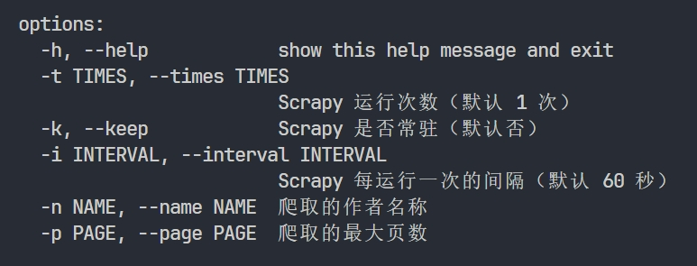

# 项目说明

## 启动爬虫

- `默认启动方式`

```bash
python main.py
```

- `自定义参数启动`

```bash
python main.py 参数... 
```

- 参数具体说明
  

- 具体演示

```bash
python main.py -t 3 -i 20  # 运行 3 次爬虫，每次间隔 20 秒
```

```bash
python main.py -n markadc  # 爬取 markadc 这个作者 
```